# MDXpress


MDXpress는 사용자가 mdx문법을 자유롭게 작성할 수 있는코드 에디터 서비스 입니다.

### 🔗 Depoly URL : https://mdxpress.ohho.dev

<br />
<br />

# Content

- ### [✨ Stacks](#-stacks)
- ### [🏛️ System Architecture](#%EF%B8%8F-system-architecture-1)
- ### [⚒️ Feature](#%EF%B8%8F-feature-1)
  - [실시간 코드 프리뷰](#1-실시간-코드-프리뷰)
  - [저장 및 링크를 통한 공유](#2-저장-및-링크를-통한-공유)
  - [써드파티 라이브러리 지원](#3-써드파티-라이브러리-지원)
- ### [🏔️ Challenges](#%EF%B8%8F-challenges-1)
  - [어떻게 써드파티 라이브러리를 지원해 줄 수 있을까?](#1-어떻게-써드파티-라이브러리를-지원해-줄-수-있을까)
  - [TTL을 설정하여 삭제된 document에 대한 정보를 어떻게 알 수 있을까?](#2-ttl을-설정하여-삭제된-document에-대한-정보를-어떻게-알-수-있을까)
  - [textArea에 Syntax Highlighting을 입힐 수 있을까?](#3-textarea에-syntax-highlighting을-입힐-수-있을까)
- ### [🤔 Memoir](#memoir)

<br />
<br />

# ✨ Stacks

### FrontEnd

<div style="display:flex;">
  
  
  
  
  
</div>

### BackEnd

<div style="display:flex;">
  
  
  
  
  
  
</div>

### Tools

<div style="display:flex;">
  
  
  
  
</div>

### Depoly

<div style="display:flex;">
  
  
</div>

<br />
<br />

# 🏛️ System Architecture

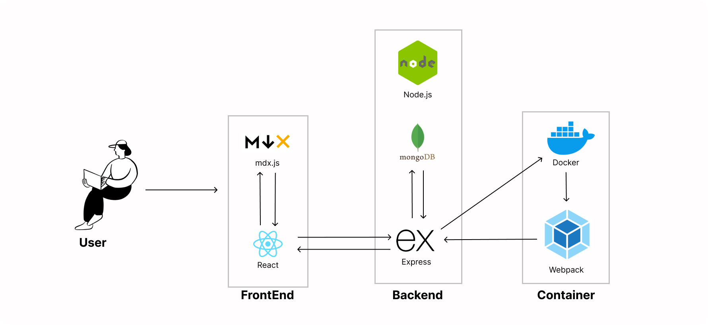

<br />
<br />

# ⚒️ Feature

### 1. 실시간 코드 프리뷰

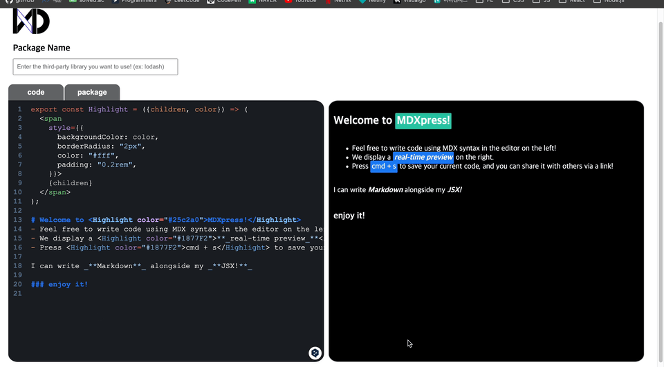
→ 사용자가 mdx문법을 이용하여 작성한 코드가 실시간으로 우측 화면에 프리뷰 됩니다.

> 문법적인 오류가 있을 경우에는 해당 오류에 대한 간략한 정보가 프리뷰에 렌더링 됩니다.

<br />

### 2. 저장 및 링크를 통한 공유

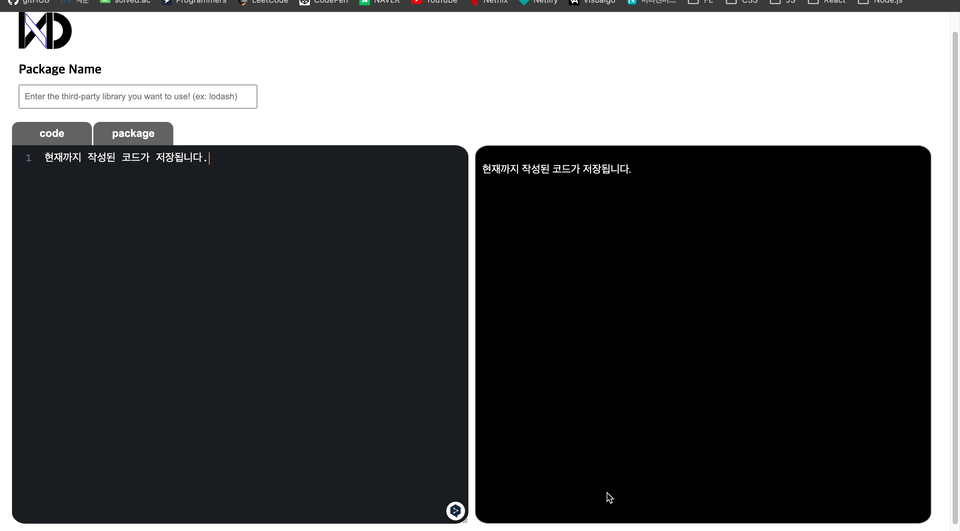

→ `CMD + S`를 누루면 사용자가 현재까지 작성된 코드를 저장 할 수 있고, 저장이 완료가 되면 URL 링크가 제공이 됩니다.<br />
해당 링크를 통해서 다른 사람들에게 공유할 수 있고, 링크로 접속 시 저장되있던 상태로 에디터가 로드 됩니다.

> 만약, 써드파티 라이브러리를 설치했다면 해당 링크로 접속 시 동일하게 자동으로 설치 됩니다.

<br />

### 3. 써드파티 라이브러리 지원

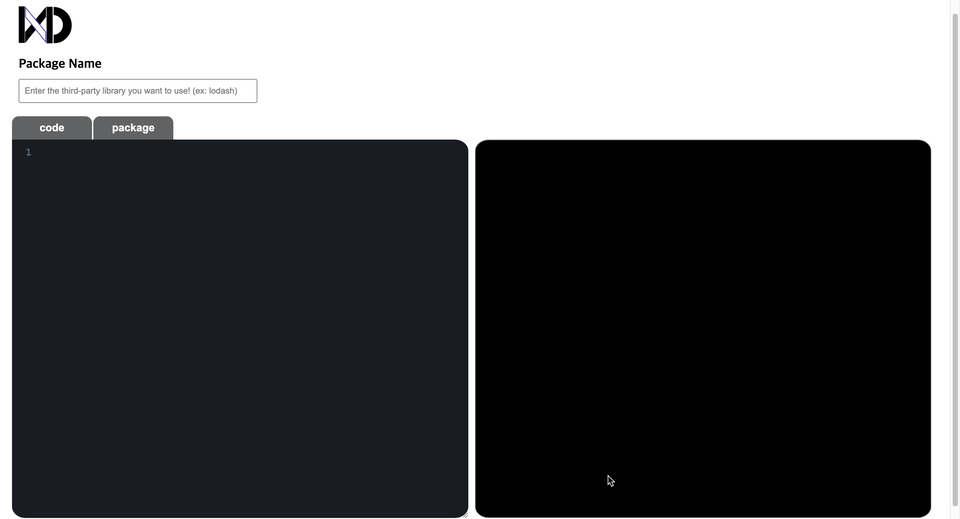
→ 사용자가 에디터 상에서 사용하고싶은 써드파티 라이브러리가 있다면, 검색해서 설치 후 사용이 가능합니다.

> 존재하지 않는 라이브러를 입력 시 우측 상단에 에러 토스트가 출력됩니다.
> (lodash 라이브러리로 시연)

<br />
<br />

# 🏔️ Challenges

## 1. 어떻게 써드파티 라이브러리를 지원해 줄 수 있을까?

### 1-1. CDN방식을 차용 해보자

초기에는 클라이언트 측에서 사용자가 필요로 하는 패키지를 설치한다면, 코드 에디터 상에서 해당 패키지를 사용할 수 있을 것이라고 가정하였습니다.<br />
그러나 예상과 달리, 프로젝트 내에서 npm을 통해 설치한 라이브러리는 사용자가 작성하는 코드 에디터 상에서 사용할 수 없었습니다.<br />
이는 사용자가 작성한 MDX 문자열이 MDX에서 제공하는 `compile API`를 통해 JSX 코드로 변환되며, 이후 run API를 통해 실행될 때 React 컴포넌트로 렌더링이 가능해지기 때문입니다.<br />
실행 시 `run API`를 통해 JSX 코드를 실행할 때 별도의 실행 컨텍스트가 생성되며, 이 컨텍스트는 클라이언트 프로젝트가 실행되는 컨텍스트와는 독립적입니다.<br />
따라서 MDX가 실행되는 환경에서는 클라이언트 측에 설치된 라이브러리의 존재를 인식할 수 없었습니다.

<div style="display: flex flex-direction: column">
  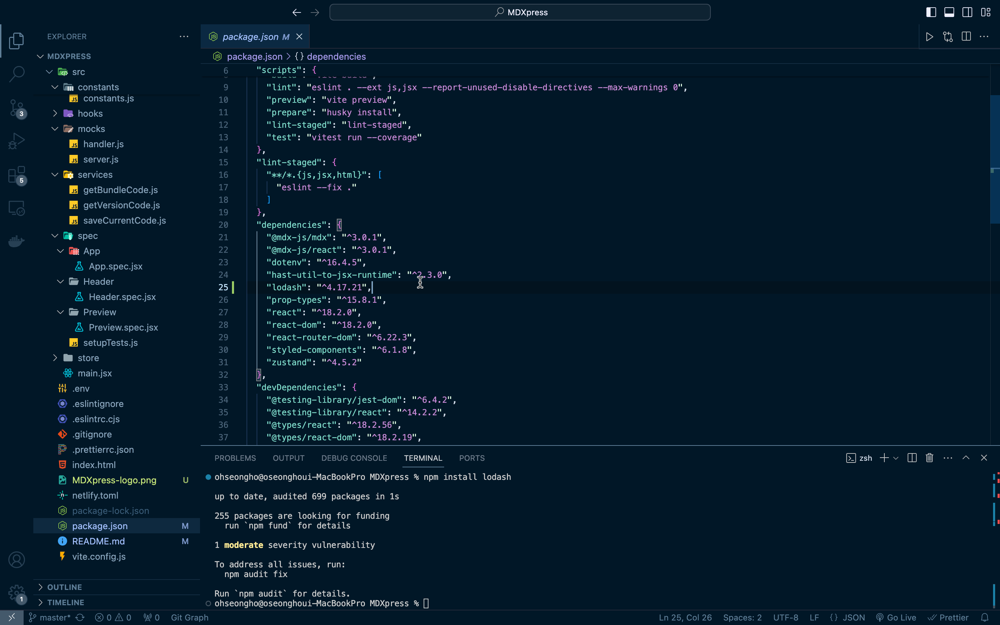
  <p>-> 클라이언트 프로젝트에 설치한 lodash 라이브러리</p>
  <br />
  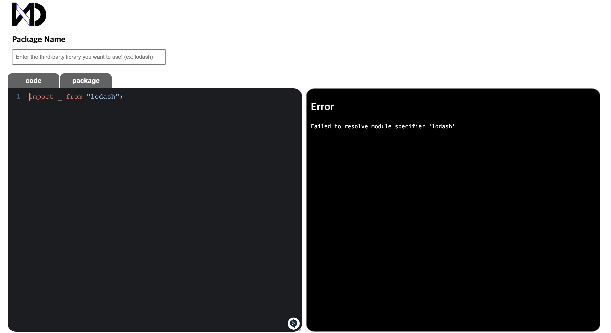
  <p>-> 사용자가 작성한 mdx에디터에서는 찾을 수 없는 모습.</p>
</div>
<br />

다른 방법을 찾아보기 위해서 여러방향의 시도중, 저는 전역 객체에 대해서는 접근이 가능하다는 것을 확인했고, 이를 활용하여 저희가 라이브러리를 사용하는 방식중에 하나인 `CDN`으로 사용하는 방식에서 아이디어를 얻을 수 있었습니다.

CDN은 script태그를 이용하여 전역적으로 해당 라이브러리를 로드시키고, 전역 변수를 통해서 접근하여 해당 라이브러리 API를 사용할 수 있게 하는 방식으로 동작합니다.

이처럼 사용자가 설치한 라이브러리를 CDN처럼 전역변수에 바인딩 시킬 수만 있다면 mdx가 실행되는 컨텍스트에서도 해당 라이브러리를 사용할 수 있을것 이라고 판단했습니다.

그렇다면<br />
_**"사용자가 설치하길 원하는 라이브러리를 cdn방식으로 제공을 해주면 되지 않을까?"**_ 라고 생각했지만<br />
써드파티 라이브러리에는 cdn방식을 제공하지 않는 라이브러리도 존재하기때문에 cdn방식을 차용을 하되, 해당 라이브러리의 직접적인 cdn은 제공하지 않는 방법을 택했습니다.

이에 따라서 처음에는 사용자가 사용하길 원하는 라이브러리를 input창에 입력하면 해당 문자열을 추출하여 서버로 전달을 하게 되면<br />
서버측에서 `childprocess`를 통해서 병렬적으로 해당 패키지를 설치를 한 뒤, webpack을 이용하여 해당 라이브러리를 컴파일 및 번들링을 해줍니다.

저는 기존에 Vite만 사용해봤었기 때문에, webpack을 직접 설정해서 사용해본적은 이번에 처음이었습니다. <br />
webpack은 번들링을 하기 위해서 entryPoint를 기준으로 모든 `import•export`구문을 찾아
dependency graph를 생성한 뒤, 해당 그래프를 기준으로 하나의 파일로 묶는 방식으로 동작합니다.

이에따라서 설치한 패키지를 번들링하기 위해서 패키지의 entryPoint를 webpack에게 제공해주어야 했고,<br />
해당 entryPoint는 nodemodules의 해당 라이브러리가 설치된 디렉토리의 `package.json`에 main이라는 프로퍼티에서 경로를 찾을 수 있었습니다.

```jsx
// getEntryPoint.js
const path = require("path");
const fs = require("node:fs");

function getEntryPointPath(packageName) {
  const packageJsonPath = path.resolve(
    __dirname,
    "node_modules",
    packageName,
    "package.json",
  );

  const packageJson = JSON.parse(fs.readFileSync(packageJsonPath, "utf-8"));
  const entryPointPath = path.resolve(
    __dirname,
    "node_modules",
    packageName,
    packageJson.main || "index.js",
  );

  console.log(`${packageJson.name} ${packageJson.version}`);

  return entryPointPath;
}

module.exports = getEntryPointPath;
```

번들링 된 코드를 클라이언트 측으로 전달하여, 클라이언트측에서는 해당 문자열을 `javascript Blob`형식으로 변환 하여 script태그를 생성합니다.

이후에 생성된 script태그를 html에 추가해주면, CDN처럼 해당 라이브러리가 전역에 바인딩이 되어서 사용자가 mdx 실행 컨텍스트에서도 사용할 수 있게 구현하였습니다.

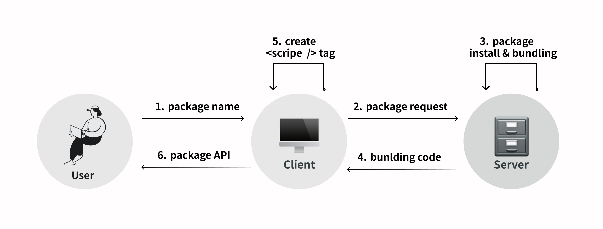

<br />

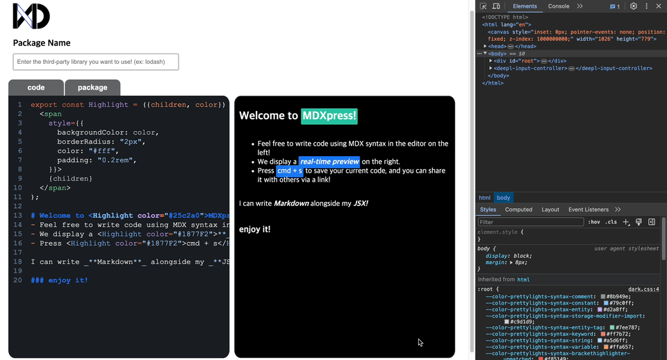

(라이브러리 요청시 script 태그가 생성되는 모습)

<br />

### 1-2 라이브러리를 설치할수록 늘어만가는 서버의 부담

이 과정에서 발견한 문제점은, 사용자가 요청하는 라이브러리를 서버 자체에 설치한다는 점이었습니다.<br />
일회성으로 사용될 수 있는 라이브러리임에도 불구하고 서버에 직접 설치하여 유지하는 것은 서버에 큰 부담을 주며, 의존성 충돌 가능성도 증가시키므로 매우 비합리적이라고 판단되었습니다.

따라서, 라이브러리를 설치하고 해당 코드를 번들링하는 과정을 가상 환경에서 수행한 후, 완료되면 해당 환경을 삭제하는 방식으로 효율적으로 관리할 수 있을 것이라고 생각했습니다. <br />
이 방법은 각 사용자별로 독립된 환경을 제공함으로써, 다른 사용자의 작업에 영향을 주지 않고, 라이브러리의 충돌이나 **의존성 문제**를 효과적으로 방지할 수 있는 장점을 가집니다.

가상 환경을 구성하기 위해 고려해야 할 두가지 옵션으로는 `VM(가상 머신)`과 `도커(Docker)`가 있었습니다.

`도커`와 `VM`을 비교해본 결과

| 도커                                                                                                                                                                                                                       | VM                                                                                                                                                                 |
| -------------------------------------------------------------------------------------------------------------------------------------------------------------------------------------------------------------------------- | ------------------------------------------------------------------------------------------------------------------------------------------------------------------ |
| • OS 수준의 가상화를 제공.<br />• 컨테이너는 호스트 OS의 커널을 공유하기 때문에 도커 컨테이너는 가상머신에 비해 훨씬 가볍고, 시작 시간이 짧음.<br />이에따라 사용자가 라이브러리를 요청하고 결과를 신속하게 받아볼 수있음. | • 하드웨어 수준의 가상화를 제공.<br />• 각 가상머신은 완전한 게스트 운영 시스템을 가지며, 이 운영 시스템은 가상 하드웨어위에서 실행됨.                             |
| • 도커 이미지를 사용하여 애플리케이션과 그 의존성을 패키지화하면, 어느 환경에서든 일관된 방식으로 실행할 수 있음                                                                                                           | • 각 가상머신은 완전히 독립된 환경을 제공함.<br />이는 보안이 매우 중요한 환경에서 유리하고, 서로 다른 운영 체제를 필요로 하는 복잡한 의존성을 관리하는 데 적합함. |
|                                                                                                                                                                                                                            | • VM은 다양한 운영 체제와 환경을 지원할 수 있으며, 특정 하드웨어 기능을 에뮬레이션하는 데 유용함.                                                                  |

<br />

#### 자원 사용과 성능 측면에서 본다면?

- `가상머신`: 각 VM은 독립된 OS를 실행하기 때문에, 상대적으로 더 많은 디스크 공간과 메모리, CPU 자원을 사용함.

- `도커`: 컨테이너는 호스트 OS와 커널을 공유하기 때문에, 가상머신에 비해 훨씬 적은 자원을 사용하며, 시작 시간도 빠름.

<br />

다양한 운영체제를 지원하는 것이 아니라 라이브러리를 격리된 환경에서 설치하는 것이 주된 목적이므로, 운영체제를 별도로 설치하여 환경을 구성하는 `VM(가상 머신)`은 과도한 엔지니어링이 될 수 있다고 생각하였습니다.<br />

이에 따라, 리소스를 효율적으로 사용하면서 충분한 격리를 제공하고, 동적인 라이브러리 설치 및 실행 요구사항을 효과적으로 지원할 수 있는 `도커(Docker)`의 도입이 더 적합하다고 판단하였습니다.

사용자가 서버에 패키지 설치를 요청할 때, 도커는 `"docker container image"`를 기반으로 한 컨테이너라는 가상 환경을 생성한 후, 이 환경 내에서 패키지의 설치 및 번들링 작업을 수행합니다.
작업이 완료된 후에는 번들링된 코드를 서버로 전송합니다.

모든 작업을 마친 컨테이너 환경은 자동으로 삭제되도록 로직을 구성함으로써, 서버 자원을 효과적으로 관리하고 의존성 충돌 문제를 해결할 수 있었습니다.

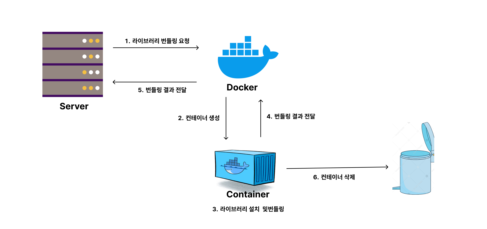

<br />
<br />

## 2. TTL을 설정하여 삭제된 document에 대한 정보를 어떻게 알 수 있을까?

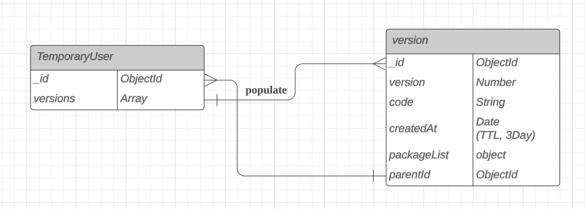

→ DataBase Schema 초안

MDXpress 서비스는 로그인하지 않은 사용자도 코드를 저장할 수 있어 데이터베이스에 많은 부담이 가는 구조였습니다.<br />
이에 따라, 저장된 버전의 유효 기간을 3일로 제한하고, 해당 document에 대해 `Time-To-Live(TTL)`을 설정하여 3일 후 자동 삭제되도록 조치하였습니다.<br />
document가 삭제되면, 삭제된 documentID를 참조하고 있는 TemporaryUser document의 versions 필드에서도 삭제된 버전의 ID 값을 제거해야 했습니다.<br />
따라서, Version document가 삭제될 때 해당 document가 참조하고 있는 userID를 활용하여 해당 TemporaryUser를 찾고, versions 필드에서도 해당 버전을 삭제하기 위해 두 개의 스키마가 상호 참조하는 구조를 설계하였습니다.<br />
<br />
이에 따라, Version document에서 삭제 이벤트가 발생할 시, 해당 ID 값을 참조하고 있는<br />
TemporaryUser의 versions 필드에서도 삭제된 Version의 ID가 제거될 수 있도록 `pre 미들웨어`를 활용한 로직을 구현하였습니다.

```js
// deleteFromParent.js
const TemporaryUser = require("../models/TemporaryUser");

async function deleteFromParent(next) {
  const parentCollection = await TemporaryUser.findById(this.parentId);
  const thisIndex = parentCollection.versions.findIndex(
    value => value === this._id,
  );

  parentCollection.versions.splice(thisIndex, 1);

  await parentCollection.save();

  next();
}

module.exports = deleteFromParent;
```

```js
// TemporaryUser.js
const deleteFromParent = require("../middlewares/deleteFromParent");

...

VersionSchema.pre("remove", deleteFromParent);
```

<br />

그러나 실제로 확인해본 결과 `pre` 미들웨어가 동작하지 않는 문제가 발생하였습니다.<br />
Mongoose에서 `pre` 미들웨어는 직접적인 document의 저장이나 삭제 같은 명시적인 작업에 반응하여 동작하지만,<br />
MongoDB에서 설정한 TTL 인덱스에 의해 자동으로 삭제되는 문서는 명시적인 삭제 명령을 사용하지 않고, MongoDB 내부적으로 문서를 삭제하기 때문에, Mongoose의 미들웨어나 모델의 이벤트 리스너와 감지 메커니즘을 통해 직접적으로 감지되지 않기 때문이었습니다.
<br />

### 2-1. 그렇다면 MongoDB 서버 내부를 직접 옵저빙 해서 찾아내자!

이를 해결하기 위해서 여러가지 방법을 찾아보다가, MongoDB에서 `Change Stream`이라는 API를 제공한다는 사실을 알게 되었습니다.<br />
`Change Stream`은 Mongo DB 데이터베이스의 실시간 데이터 흐름으로 insert, update, replace, delete 등등 이벤트데이터베이스에 대한 실시간 변경 이벤트를 제공해주는 API로써<br />
이를 활용하면 document가 TTL로 인해 삭제 되는 것 또한 감지를 할 수 있었습니다.

다만 또다른 문제점은 삭제를 감지할수는 있지만 삭제된 document에 대하여 objectId와 같은 최소한의 정보만을 제공해주고, full document(전체 정보)를 제공하지 않는다는 점 이었습니다. <br />
version document의 parentId필드 값을 사용하지 못하게 됨에 따라서

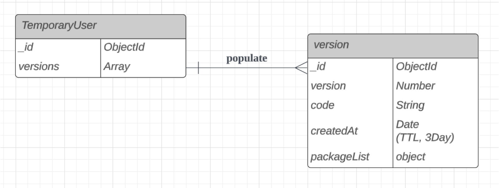

위 와 같이 DB스키마를 수정한 뒤, 삭제된 version의 ObjectId값을 갖고있는 TemporaryUser를 찾은 뒤, 직접 삭제해주는 로직으로 수정하여 해결 할 수 있었습니다.

<br />

## 3. textArea에 Syntax Highlighting을 입힐 수 있을까?

### 3-1 Syntax Highlighting은 어떻게 이루어지는걸까?

첫 에디터 구상 단계에서는 `codeMirror`, `monacoEditor`와 같이 강력하고 syntax Highlighting또한 기본적으로 지원해주는 기능이 풍부한 코드 에디터 라이브러리들이 많이 존재하기 때문에 이러한 라이브러리를 사용하여 구현하려고 하였으나<br />
기획단계가 구체화 될 수록, 제가 구현하고자 하는 에디터는 사용자가 입력한 코드를 실시간 렌더링해주는 것이 주된 목적으로 명확해졌고,<br />에디터에서 그 이상의 복잡한 기능을 필요로 하지 않기 때문에 textArea를 사용하여도 제가 원하는 목적을 이룰수 있음과 동시에 **단순성**과 **경량성**의 측면에서 이점을 가져 갈 수 있다고 판단이 되어서 textArea를 사용하여 코드에디터를 구현하게 되었습니다.

이는 곧 `Syntax Highlighting`을 기능으로 구현해 주어야 함을 의미했습니다.

사용자가 입력한 문자열에 스타일을 입힌다는 과정이 에디터를 사용하면서는 당연하게 제공되는 기능이라고 생각을 했지만 막상 구현을 하려고 하니 이 기능을 제공해주기 위해서 어떤 매커니즘을 도입을 해야할지 막막했습니다.

textArea를 통해 텍스트 에디터를 구현하게 되면 일반 텍스트만을 지원하기 때문에, 내부의 텍스트에 부분적으로 스타일을 적용하는것은 불가능했기에<br />
여러 에디터 및 하이라이터 라이브러리들이 Syntax Highlighting을 어떻게 제공을 해주고 있는지 살펴보았습니다.

그 결과 대부분의 하이라이터들이 크게 `파싱`, `변환`, `생성` 이렇게 3단계를 통해서 하이라이팅을 구현하고 있는 것을 알 수 있었습니다.

그중에 `파싱 단계`는 아래와 같은 매커니즘으로 동작하고 있었습니다.

1. 사용자가 입력한 텍스트를 `스캐너(scanner)`라고도 하는 Lexical analyzer를 활용하여 정의 된 규칙대로 문자 스트림(코드)을 읽고 이를 `토큰`으로 결합하여 결국 전체 코드 문자열이 `토큰 목록`으로 분할시킵니다.

2. 분할된 토큰 목록을 가져 와 `파서(parser)`라고도 불리는 Syntax analyzer를 통해서 검증을 실시하고
   **트리 구조로 변환**합니다.
   이때 만들어지는 트리를 `추상 구문 트리(Abstract Syntax Tree` 라고 부릅니다.

<br />

이렇게 AST를 구축하고, 적용된 플러그인에 기반하여 AST를 탐색하며 수정한 후, 수정된 AST로부터 새로운 코드를 생성하는 과정을 거치게 됩니다.

이러한 과정을 위해 MDX문법을 지원해주는 하이라이터 라이브러리인<br />
`starry-night`라이브러리를 사용하였고, 사용자가 입력한 문자열을 AST로 변환하고, 스타일을 입힌 코드로 바꿀수 있었습니다.

이후 사용자가 textArea에 입력한 문자열을 라이브로 추출하여 내용이 바뀔 때 마다 하이라이팅된 결과를 받아올 수 있게 함으로써 실시간으로 사용자에게 하이라이팅 된 결과를 제공할 수 있었습니다.

```text
// 1. 사용자가 문자열을 입력
# h1
```

```js
// 2. 해당 문자열로부터 생성된 AST를 하이라이팅이 될 수 있는 AST로 수정
{
  type: 'root',
  children: [
    {
      type: 'element',
      tagName: 'span',
      properties: {className: ['pl-mh']},
      children: [
        {type: 'text', value: '# '},
        {
          type: 'element',
          tagName: 'span',
          properties: {className: ['pl-en']},
          children: [{type: 'text', value: 'hi'}]
        }
      ]
    }
  ]
}
```

```html
// 3. 수정된 AST를 기반으로 하이라이팅 된 새로운 코드 생성
<span class="pl-mh">
  <span class="pl-mh">#</span>
  <span class="pl-mh"> </span>
  hi
</span>
```

<br />

### 3-2. 어떻게 사용자가 입력하는 문자열이 하이라이팅 된 코드처럼 보이게 할 수 있을까?

하이라이팅 처리된 결과를 도출함으로써 <br />
**사용자가 문자열을 입력하는 textArea 영역**(이하 `EditorWrite`)과 입력한 코드를 **하이라이팅 처리하여 스타일이 입혀진 코드를 렌더링 시켜주는 영역**(이하 `EditorView`)를 분리하였습니다.<br />

실시간으로 사용자가 입력하는 문자열이 하이라이팅된 것처럼 보이게 하는 구현 방안을 고민한 결과, `EditorWrite`와 `EditorView` 영역을 겹치게 한 후, 사용자가 입력하는 문자열은 숨기고 하이라이팅 처리된 문자열만을 보여주는 방법을 생각하게 되었습니다.<br />
사용자의 입력을 받을 `EditorWrite`의 position을 absolute로 설정하여 `EditorWrite` 영역을 `EditorView` 영역 위에 겹치도록 설정한 뒤,<br />
color와 background-color를 `transparent`로 설정함으로써 사용자에게는 현재 입력하고있는 커서의 위치만 보이도록 하였습니다.<br />
이 방식을 적용한 결과, 사용자가 입력하는 것은 텍스트 영역이지만, 실제로 보는 것은 하이라이팅 처리된 코드가 되게끔 구현 할 수 있었습니다.<br />

성공적인 결과를 얻었으나, `EditorWrite`와 `EditorView`가 별도로 구분되어 있지만 사용자가 조작할 수 있는 영역은 EditorWrite영역이었기에, 해당 영역에 스크롤이 생기거나, 화면의 사이즈가 조절이 되면 EditorView영역도 동일하게 움직여야 했습니다. <br />
추가적으로, EditorWrite에서 작성하는 문자열의 위치와, 렌더링 되는 문자열의 위치가 완벽하게 동일해야 했습니다.<br />

이 문제는 두 영역 내에 작성된 문자열의 스타일을 동일하게 설정하고, 입력된 문자열이 제공된 영역을 초과하여 스크롤이 발생하면 `EditorWrite`의 scrollLeft, scrollTop값을 추출하여 globalState로 관리하였고, 해당 상태값을 `EditorView`의 scrollValue에 동일하게 설정함으로써 두 영역의 스크롤 위치를 동기화 시켜 줄 수 있었습니다.<br />

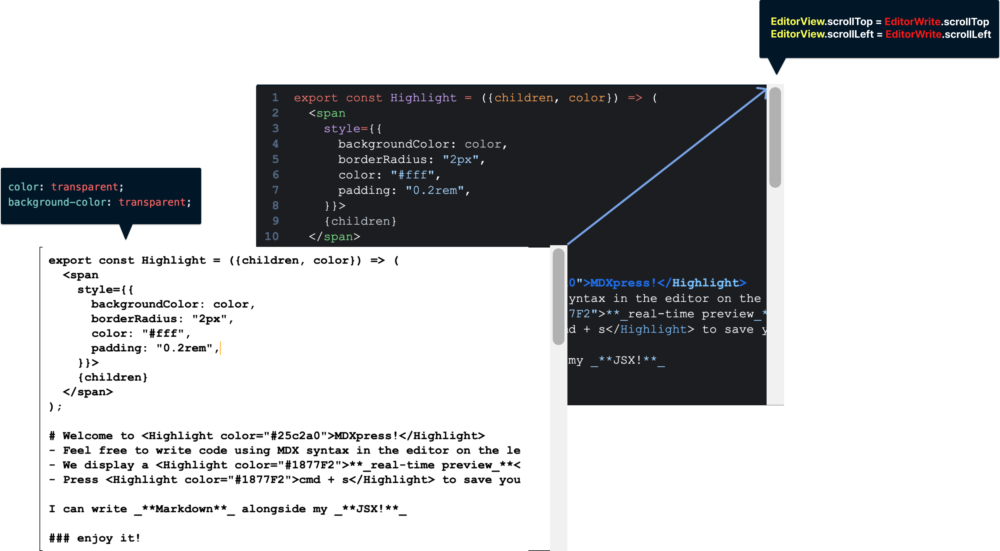

<br />

이와 같은 방법으로 마치 두 개의 영역이지만 실제로는 하나의 영역처럼 사용자가 느끼도록 할 수 있었습니다.

<br />

<br />
<br />

# 🤔 Memoir

이번 프로젝트를 통해 본인을 객관적으로 바라보며 단점을 파악할 수 있는 경험이 되었다고 생각합니다. 프로젝트에서 새로운 기술 스택과 익숙하지 않은 개념들을 많이 다뤄 보았습니다.<br />
새로운 기술 도입을 시도하며 코드 작성보다 학습하는 데 더 많은 시간을 할애했을지도 모릅니다. 그 과정에서 _**"이 방식으로 로직을 작성하는 것이 맞는 방법인가?"**_ 라는 의문을 수백 번도 더 가졌습니다.<br />

로직이 완전히 확립되지 않으면 코드 작성을 시작하지 못하는 스타일이었으나, 새로운 기술과 개념에 로직을 완전히 세우려 하다 보니 우선 순위를 정하지 못하고 생각만 많아져 코드 작성을 시작하지 못한 경우가 많았습니다.<br />
지금 와서 생각해본다면 새로운 기술이나 익숙하지 않은 것에 도전하는 데 있어 자신감이 부족했습니다.<br />
_**"고민만 하고 실행하지 않으면 고민이 무거워진다"**_ 라는 말이 적절할 것 같습니다.<br />그래서 _**"일단 시도해 보자. 되지 않으면 다시 시작하면 된다"**_ 는 생각으로 코드를 작성해 보니 걱정했던 것과 달리 큰 문제가 발생하지 않았고, 점점 자신감이 붙어서 결과적으로 프로젝트를 완성시킬 수 있었습니다.
<br />

프로젝트를 진행하며 새로운 개념에 부딪힐 때마다 어떻게 구현해야 할지 막막함을 느꼈고, 라이브러리를 분석하는 과정에서 예상치 못한 코드 양에 좌절하기도 했습니다.<br />
그러나 작업 스타일을 조금 바꿔 보니 문제가 해결되는 과정을 경험하면서 다양한 시각을 가지게 되었고, 새로운 도전에 대해 조금은 자신감을 갖게 되었습니다.<br />

개발 분야는 흐름과 트렌드가 빠르게 변하기 때문에, 개발자는 항상 새로운 기술을 학습하고 익숙해져야 합니다.<br />
이 경험은 앞으로 개발자로서 성장하기 위한 역량을 더욱 강화하는 소중한 기회가 되었다고 생각합니다.
